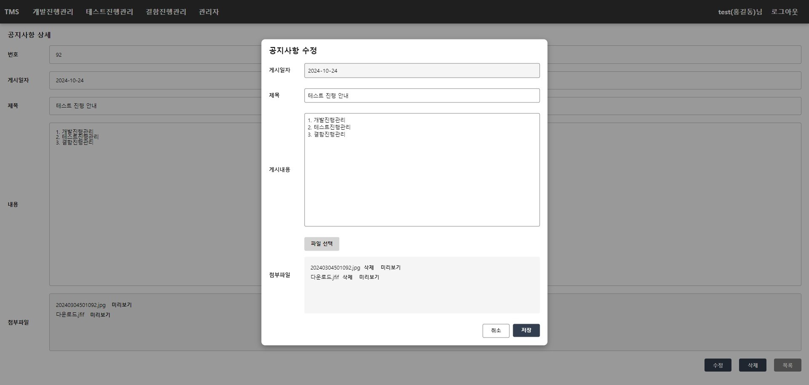

## TMS(Test Management System)

### 로그인

  

### 개발진행관리

  
  
  

### 테스트진행관리

  
  
  

### 결함진행관리

  
  
  

### 사용자관리

  
  
  

### 공통코드관리

  
  
  

### 분류코드관리

  
  
  

### 공지사항

  
  
  
  

### 기타

  
  
  
  

  
  
  
  

