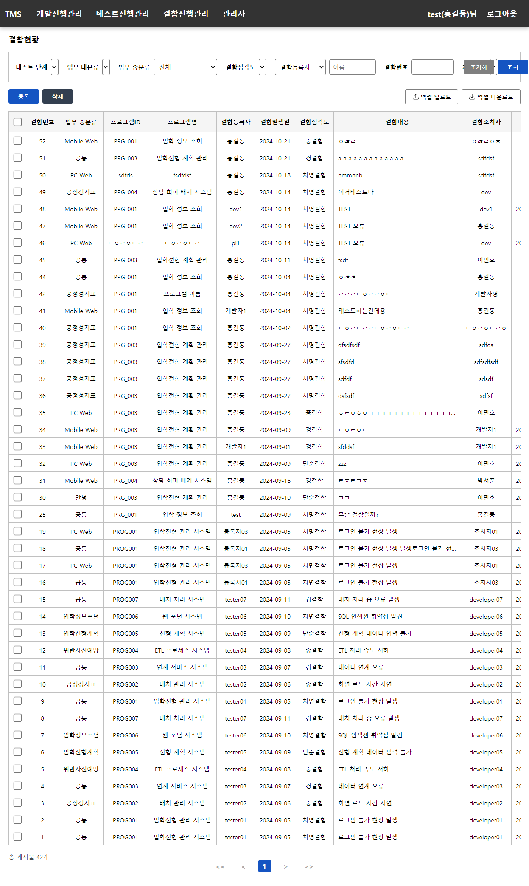

# TMS(Test Management System)

## 로그인

  

## 개발진행관리

### 조회 및 삭제

  

### 등록

  

### 수정

  

## 테스트진행관리

### 조회 및 삭제

  

### 등록

  

### 수정

  

## 결함진행관리

### 조회 및 삭제

  

### 등록

  

### 수정

  

## 사용자관리

### 조회 및 삭제

  

### 등록

  

### 수정

  

## 공통코드관리

### 조회 및 삭제

  

### 등록

  

### 수정

  

## 분류코드관리

### 조회 및 삭제

  

### 등록

  

### 수정

  

## 공지사항

### 조회 및 삭제

  

### 등록

  

### 수정

  

### 상세조회

  

## 기타

### 네비게이션바

  

### 엑셀 다운로드

  

### 엑셀 업로드

  

### 첨부파일 미리보기

  

### 기발생 결함번호 조회

  

### 수정대상 결함번호 조회

  

### 화면정보 조회

  

### 프로그램 정보 조회

  

